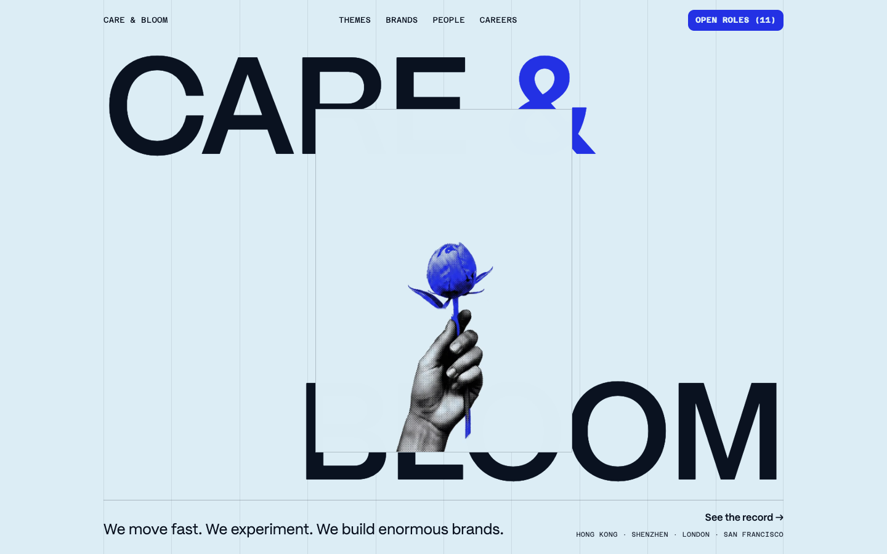
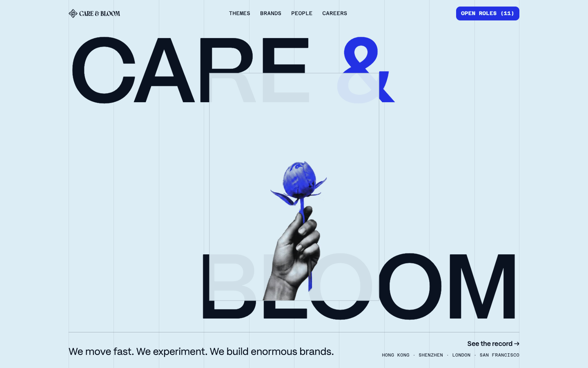
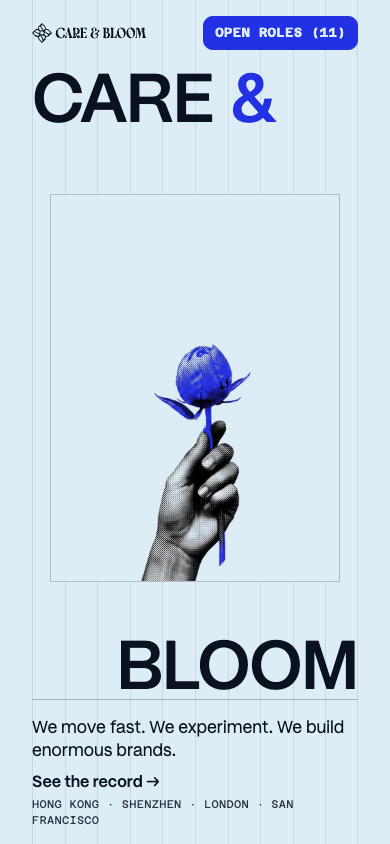
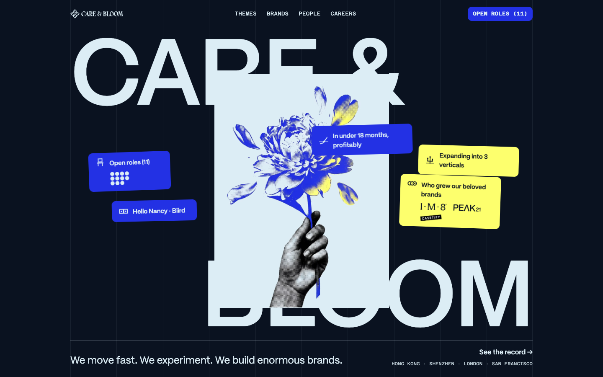
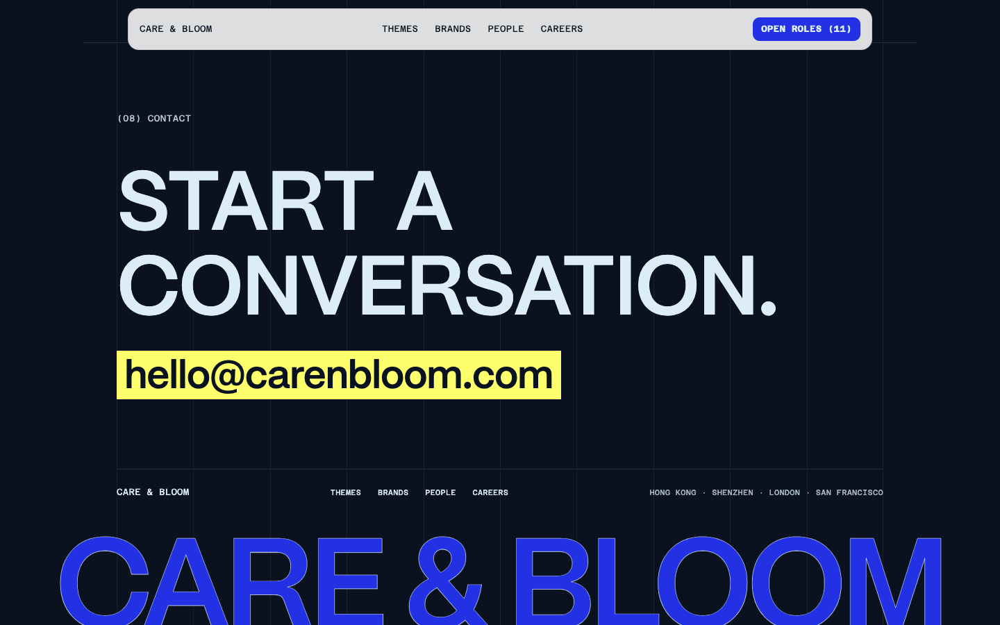
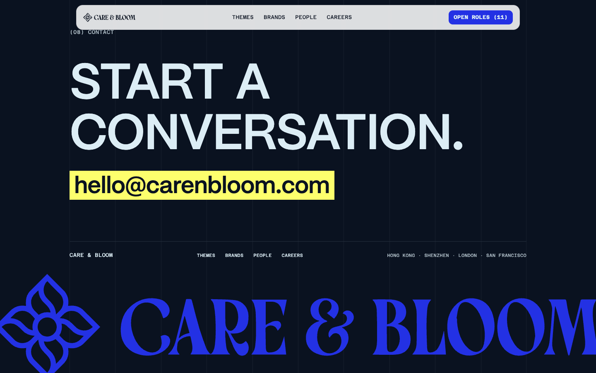
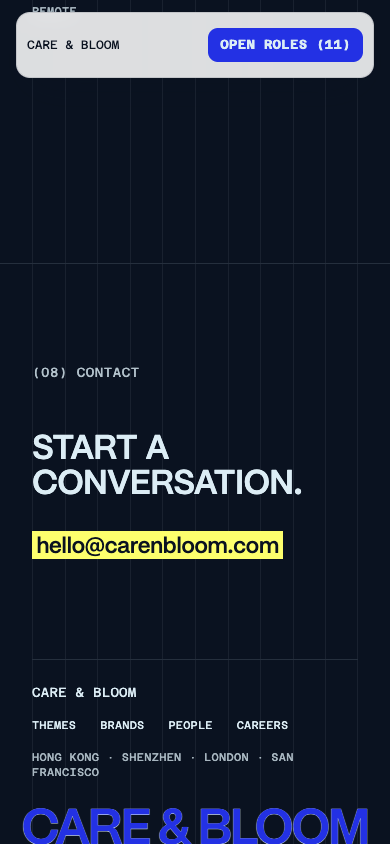
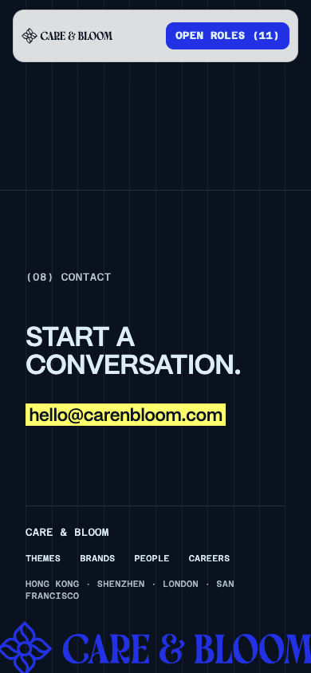

# Care & Bloom logo replacement evidence

Captured locally with `chrome-devtools-axi` on 2026-08-07.

The baseline images were captured from the untouched task `HEAD` served separately from the implementation worktree.

## Desktop header — 1440×900

| Before | After |
| --- | --- |
|  |  |

## Mobile header — 390×844

| Before | After |
| --- | --- |
|  |  |

The full lockup remains in use on mobile because it fits without crowding the roles chip at 390px, 360px, or 320px.

The measured logo box is 126×21.95px on desktop and 114×19.86px on mobile.

At 390px the bar is 326px wide, the logo ends at x=146, the roles chip begins at x=203.34, and document overflow is 0px.

## Header theme proof

| Light token | Dark token |
| --- | --- |
|  |  |

These two frames are an isolated inheritance proof: the browser applied the existing `--color-accent` and `--color-ink-2` tokens to the labelled brand link without changing the SVG markup.

In both cases the `<use>` fill computed to the same RGB value as the link's `color`.

The production SVG therefore follows the surrounding theme through `currentColor`; no colour value or duplicate theme rule is embedded in the logo.

## Footer sign-off

| Desktop before | Desktop after |
| --- | --- |
|  |  |

| Mobile before | Mobile after |
| --- | --- |
|  |  |

The footer SVG overscans the viewport by 1% per side and clips the bottom 6.6% of its rendered height.

At 1440px the SVG measured 1468.8×255.97px inside a 1440×239.03px clip, with 0px document overflow.

The footer logo computed to `rgb(35, 49, 228)` from `--color-accent`, reported zero animations, and remained fully present.

## Known baseline failure

`tests/footer-wordmark.test.mjs` still fails at the pre-existing restored-back-navigation sampler because it captures no samples.

The assertion was not weakened, skipped, or otherwise masked.

The test reaches and passes the new inline-SVG, accessible-name, `currentColor`, fresh-load static, critical-only, reload, and hash-arrival checks before reaching that known failure.
